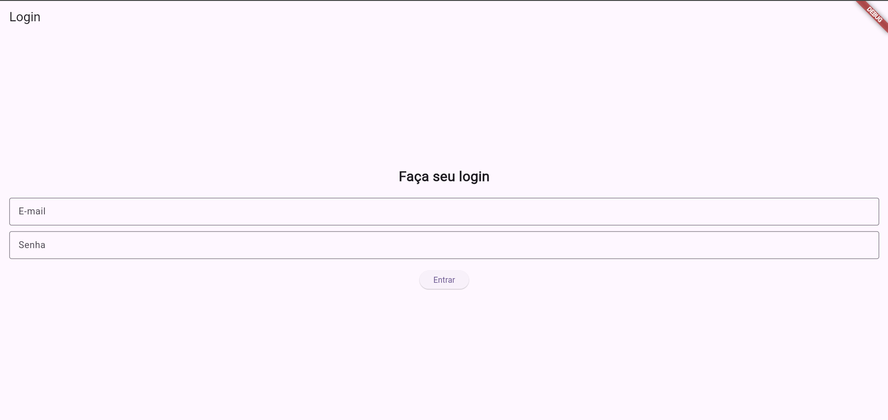
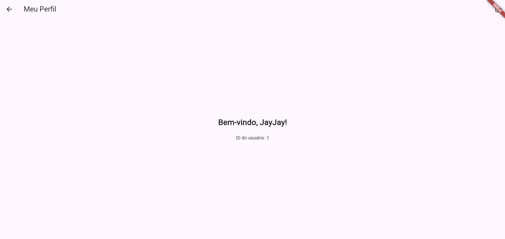
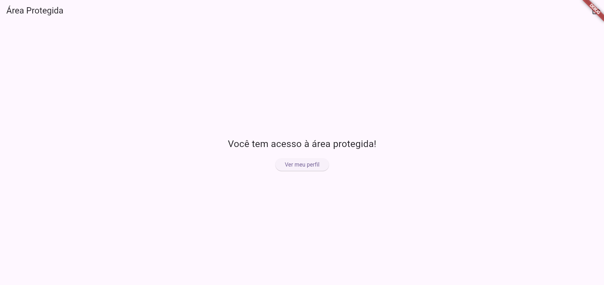
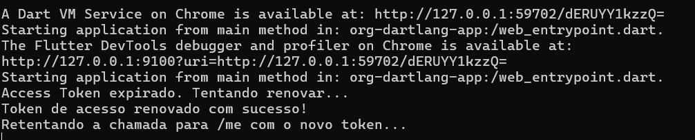

# App de Autenticação em Flutter

Este é um aplicativo de exemplo desenvolvido em Flutter que demonstra um fluxo completo de autenticação de usuário. O app inclui uma tela de login, comunicação com uma API backend, armazenamento seguro de tokens e navegação para uma tela protegida.

Este projeto foi criado como parte do treinamento "Flutter + Node.js — Tela de Login e Autenticação".

## Funcionalidades

*   Tela de login com validação de email e senha.
*   Comunicação com API REST para autenticação.
*   Armazenamento seguro de `accessToken` e `refreshToken` usando `flutter_secure_storage`.
*   Renovação automática de `accessToken` quando ele expira, proporcionando uma sessão contínua para o usuário.
*   Navegação para uma tela de perfil protegida que busca dados do usuário.
*   Funcionalidade de Logout seguro.

## Pré-requisitos

*   [Flutter SDK](https://docs.flutter.dev/get-started/install) (versão 3.x recomendada)
*   Um editor de código como [VS Code](https://code.visualstudio.com/) ou [Android Studio](https://developer.android.com/studio).
*   Um emulador Android, simulador iOS ou o Google Chrome para rodar a aplicação web.

## Instalação e Setup

1.  **Clone o repositório:**
    ```bash
    git clone <url-do-seu-repositorio-flutter>
    ```

2.  **Navegue até a pasta do projeto:**
    ```bash
    cd nome-da-pasta-do-projeto-flutter
    ```

3.  **Instale as dependências:**
    ```bash
    flutter pub get
    ```

## Configuração

**IMPORTANTE:** Este aplicativo precisa se conectar à [API de Autenticação (backend)](link-para-seu-repositorio-backend). Certifique-se de que o servidor da API esteja rodando antes de executar o app.

Pode ser necessário ajustar o endereço da API no seguinte arquivo:

`lib/services/api_service.dart`

```dart
// Mude o IP conforme necessário:
// final String _baseUrl = 'http://localhost:3000/api/auth'; // Para Web (Chrome) e iOS Simulator
// final String _baseUrl = 'http://10.0.2.2:3000/api/auth';  // Para Emulador Android
```

## Screenshot
| Tela de Login | Tela de Perfil | Tela da HomePage | Tela do Token CMD |
| :-----------: | :------------: |:----------------:| :---------------: |
|  |  |  |  |